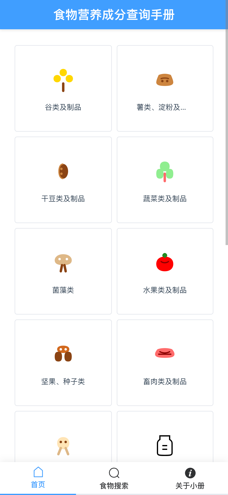
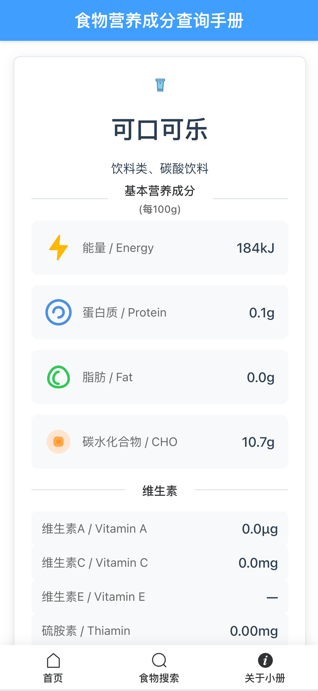

# 食物营养成分查询小册H5
## 小册介绍
本小册是通过AI集成开发环境工具（Trae)，结合从聚合数据（JUHE.CN）免费下载的食物营养成分数据库，快速实现了一个简单的食物营养成分查询小册H5。(基本是与AI对话，Trae自动实现的😁)

主要功能：查询食物的每100克的营养成分信息，如能量、蛋白质、脂肪、碳水化合物、维生素、矿物质等含量。

- Trae IDE介绍：
Trae 是一款字节跳动推出了一款面向海外市场的AI编程工具。旨在改变您的工作方式，通过协作帮助您提高工作效率，运行更迅速。[【访问官网】](https://www.trae.ai)

- 聚合数据介绍：
一家综合性API数据流通服务商，致力于为客户提供数据处理标准化技术服务和数据处理定制化技术服务。Juhe.CN平台提供很多免费的API和数据集下载。[【访问官网】](https://www.juhe.cn/market/product/id/11087)

##目录结构
```
├── backend 后端代码目录
│   ├── food_nutrition.db 食物营养成本SQLite3数据库文件（可以从聚合数据下载最新的替换）
│   ├── main.py 
│   ├── food_api.py 
│   └── requirements.txt
│   └── ......
├── frontend 前端代码目录
│   └── ......
```

## 运行前端服务(Vue.js)

```shell
cd frontend
npm install
npm run dev
```

## 运行后段服务(Python FastAPI)
```shell
cd backend
pip install -r requirements.txt
python -m uvicorn main:app --reload
```

## 浏览器访问
```
http://localhost:5173
```

## 最终效果图

